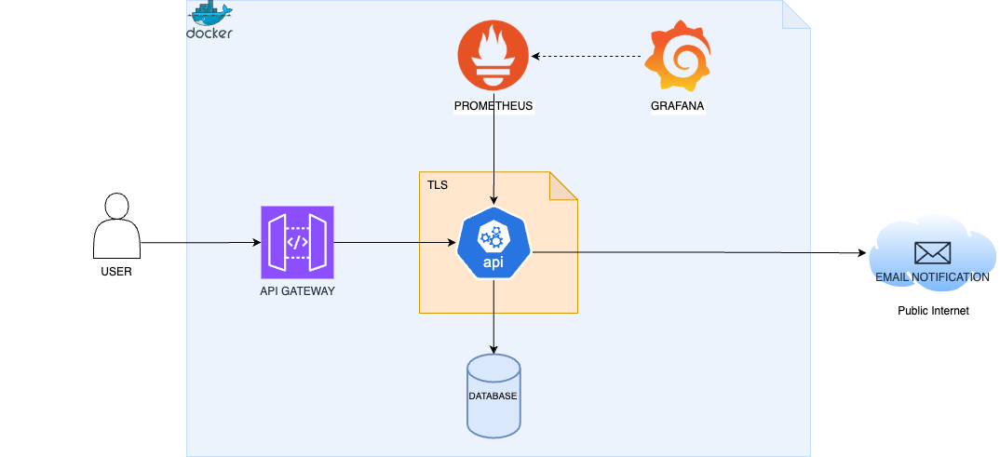

# Challenge

API para cadastro de pessoa e envio de notificação de forma assíncrona, desenvolvida utilizando solução de containers, DDD e arquitetura hexagonal.

## Tecnologias utilizadas:

- Java (17)
- Spring
- Gradle
- TLS
- H2 Database
- Micrometer
- Prometheus
- Grafana
- Localstack
- Docker
- Docker compose
- Terraform


## Como executar o projeto:

### Gerar artefatos

Antes de iniciar o projeto usando containers é necessário realizar o build do mesmo utilizando gradle.

Executar o seguindo comando na linha de comando:
```bash
./gradlew build
```

Após o build ser finalizado com sucesso, o diretório contendo os artefatos compilados será criado com o nome '_build_'.


### Iniciar containers

Uma vez que os artefatos tenham sido gerados, o projeto está pronto para ser executado utilizando containers.

Ao executar o comando:
```bash
docker compose up -d
```

Os serviços, '_challenge_', '_localstack_', '_prometheus_', '_grafana_', '_elasticsearch_' e '_filebeat_' serão iniciados.

### Configurar api gateway
Para configurar os recursos do api-gateway, é necessário ter instalado o [terraform](https://developer.hashicorp.com/terraform/install) na sua máquina.
Uma vez instalado, os seguintes comandos devem ser executados:

- terraform init
- terraform plan
- terraform apply

Uma vez que as alterações foram aplicadas e a execução finalizada sem erros, o api gateway está pronto para ser utilizado.


## Usando os serviços
O serviço tem 5 endpoints disponíveis para integração.

- **POST** - /cadastros/adicionar (Criar um novo cadastro)
- **GET** - /cadastros/{cadastroId} (Recuperar um cadastro utilizando um id)
- **GET** - /cadastros/ (Recuperar todos os cadastros)
- **PATCH** - /cadastros/{cadastroId} (Atualizar os dados de um cadastro)
- **DELETE** - /cadastros/{cadastroId} (Deletar um cadastro)

No diretório sample, o arquivo _requests.txt_ possui um cURL de exemplo para cada endpoint.

#### Open API

Também é possível acessar o swagger através do endereço e visualizar os recursos disponíveis.

https://localhost:8443/swagger-ui/index.html


### Recursos (Containers)

Como a aplicação está utilizando o protocolo TLS, a mesma só pode ser acessada utilizando HTTPS, 
para tornar isso possível um certificado auto-assinado foi gerado e está disponível no diretório _/data/cert_.

- https://localhost:8443 (Aplicação)
- http://localhost:4566 (Localstack)
- http://localhost:9090 (Prometheus)
- http://localhost:3000 (Grafana)


## Arquitetura




### Validações

Todas as requisições possuem validações e mensagens de erro intuitivas para ajudar o usuário a entender o 
comportamento da aplicação e porque foi retornado um erro.
